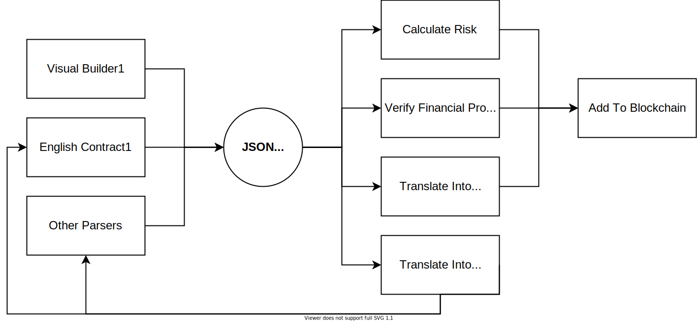

# Fintracts - Easy Financial Contracts

Fintracts aims to be an ecosystem of tools to make it easy to write financial, risk-aware, smart contracts through a common [JSON Contract Format](SPECIFICATION.md). A simple use case would be that contracts in other formats (e.g. in an English Grammar) can be converted to this common JSON Contract Format, which can then be converted, using a different tool, to an functional smart contract.

## Ecosystem

<small>1: The tools present in this repository.</small>

**Existing tools:**

- [Visual Builder](builder/): uses a web GUI to walk the user through the options to generate a contract.
- [English Parser](parser/): converts a contract written in English to the common specification.
- [JSON Validator](validator/): validates the JSON of a contract. Optionally, can fix auto-fixable errors.

**Interesting tools** that could be built and use cases:

- Tool to calculate the risk of a certain financial contract. With this tool, what "risk" means would need to be defined.
- Tool to convert the JSON contract into a [Solidity](https://soliditylang.org/) smart contract to be applied in the Ethereum blockchain.
- Tool to verify certain financial properties, such as if both parties are able to carry on the contracts according to their portfolios.
- A tool that converts a contract in JSON to French. This way, someone can write a contract in English, then use the English parser and then convert it to French. This would help translation of financial contracts through a common format.

## Research Notes

This project was started at [TU Eindhoven](https://tue.nl/). Read more about the motivation and research notes [here](NOTES.md).

## License

[MIT © Henrique Dias](LICENSE)
